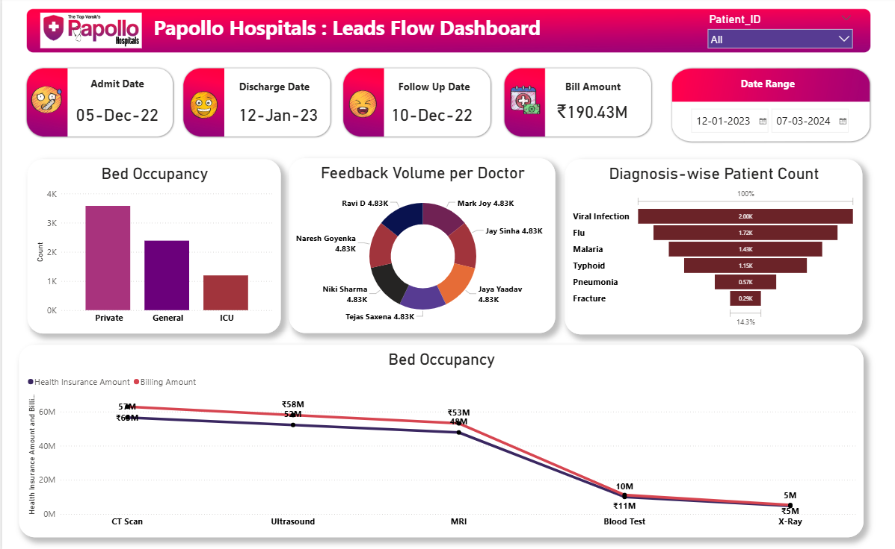

# Papollo Hospitals Leads Flow Dashboard

## Project Overview

The **Papollo Hospitals Leads Flow Dashboard** is an interactive Power BI dashboard designed to analyze hospital operations, patient flow, bed occupancy, diagnosis trends, doctor performance, and financial metrics. The dashboard provides a comprehensive view of key healthcare indicators, enabling stakeholders to make informed decisions and improve operational efficiency.

---

## Dashboard Snapshot


---

## Objectives

* Monitor patient admissions and discharges.
* Analyze bed occupancy across different ward types.
* Track diagnosis-wise patient distribution.
* Evaluate doctor-wise feedback volume.
* Compare billing and health insurance amounts.
* Provide actionable insights through interactive visualizations.

---

## Key Features

### Patient Information

* Admit Date Tracking
* Discharge Date Tracking
* Follow-Up Date Monitoring
* Patient ID Filtering

### Bed Occupancy Analysis

* Occupancy distribution across:

  * Private Rooms
  * General Wards
  * ICU Beds

### Doctor Performance

* Doctor-wise feedback volume analysis
* Performance comparison using interactive visuals

### Diagnosis Analysis

* Patient distribution by diagnosis:

  * Viral Infection
  * Flu
  * Malaria
  * Typhoid
  * Pneumonia
  * Fracture

### Financial Analysis

* Total Billing Amount Analysis
* Health Insurance Amount Analysis
* Test-wise revenue comparison:

  * CT Scan
  * Ultrasound
  * MRI
  * Blood Test
  * X-Ray

### Interactive Filters

* Patient ID Slicer
* Custom Date Range Selection

---

## Tools & Technologies

* Power BI
* Power Query
* DAX
* Data Modeling
* Data Visualization

---

## Key Insights

* Private rooms have the highest bed occupancy among all categories.
* Viral Infection and Flu account for the largest share of patient diagnoses.
* MRI, CT Scan, and Ultrasound contribute significantly to hospital revenue.
* Billing and insurance amounts show similar trends across diagnostic tests.
* Doctor feedback volumes are relatively balanced across practitioners.

---

## Files Included

```text
Papollo_Hospitals_Dashboard.pbix
Papollo-Healthcare-Dataset.xlsx
Dashboard.png
README.md
```

---

## Skills Demonstrated

* Data Cleaning & Transformation
* Data Modeling
* DAX Calculations
* Dashboard Design
* Business Intelligence Reporting
* Healthcare Data Analysis

---

## Author

**Kousik Chakraborty**

Aspiring Data Analyst | Power BI | SQL | Python | Excel


